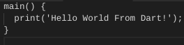
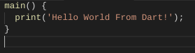
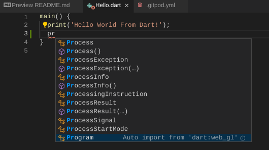

# Dart in Gitpod

## Installing Dart

To install the Dart SDK in Gitpod one must add the following to your [.gitpod.Dockerfile](https://gitpod.io/docs/config-docker)

```Dockerfile
RUN brew tap dart-lang/dart && brew install dart
```

## VSCode Extensions

### Dart

This Extension adds cool syntax highlighting

#### Before



#### After




It adds [Intellisense](https://code.visualstudio.com/docs/editor/intellisense) support for autocompletion



## Try it

Here is a hello world example of a [Gitpodified](https://www.gitpod.io/blog/gitpodify/) project running in the browser, try it!

[](https://gitpod.io/#https://github.com/gitpod-io/Gitpod-Dart)
